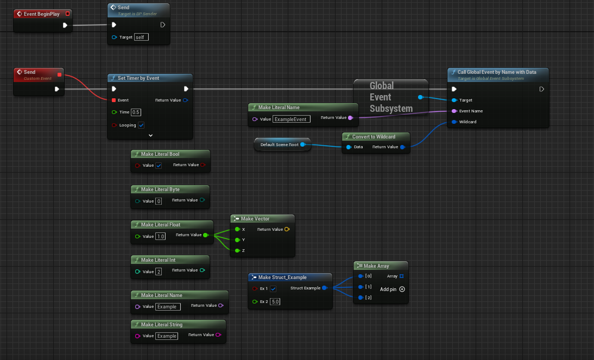
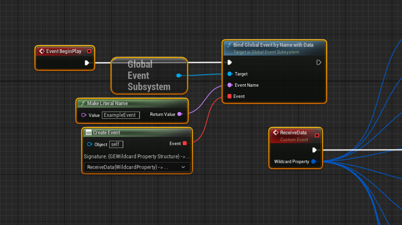
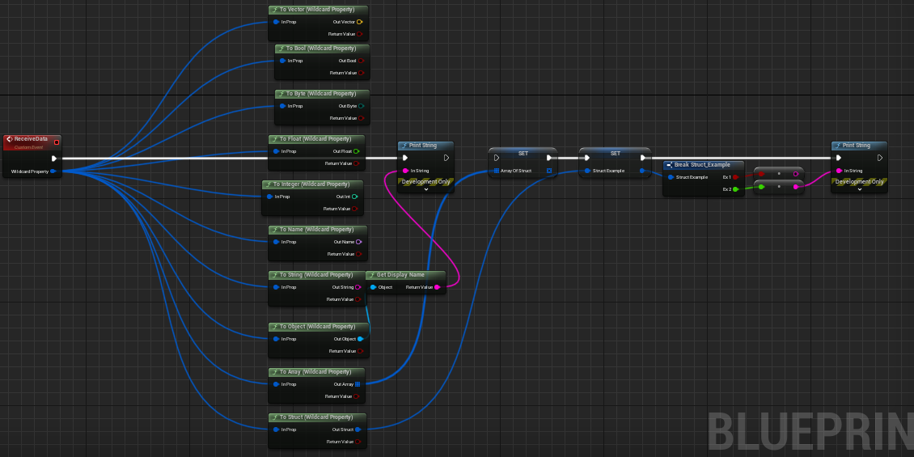
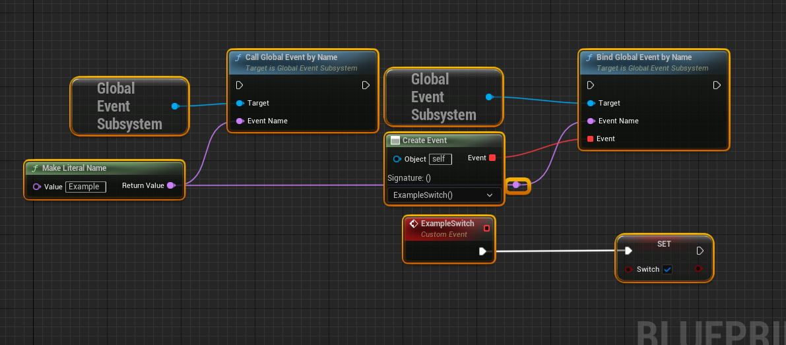
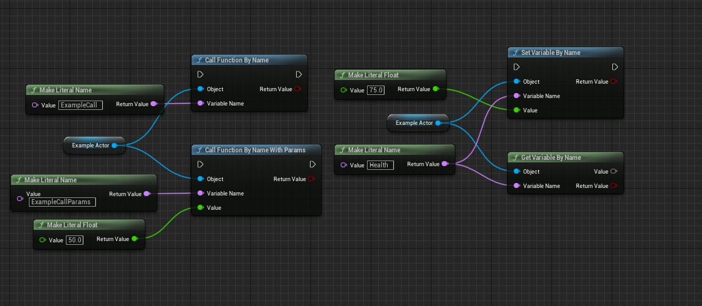

# Global Event Subsystem 
 
This plugin is based on [GlobalEvent](https://github.com/getnamo/GlobalEventSystem-Unreal), but simplified and wrapped to subsystem.

List of all supported formats that can be sent and received.

Example how to bind event with additional data.

All supported convert nodes. If you need to pass rotator or transform you can modify plugin or wrap it in struct.

Simple event without additional data. Can be used as trigger.

Some handy nodes that were created at the same time as plugin, but they are not a part of plugin whatsoever. 

